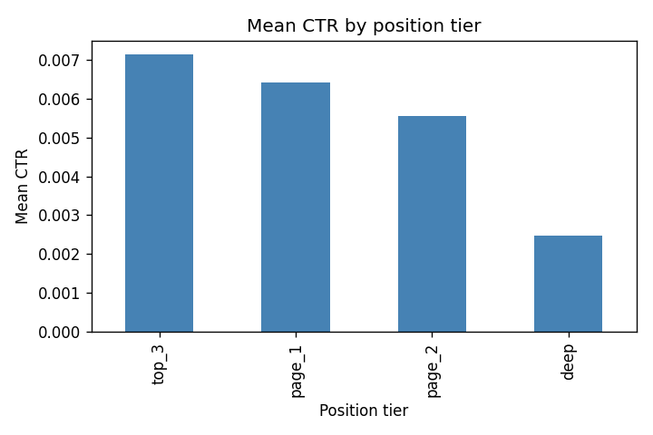
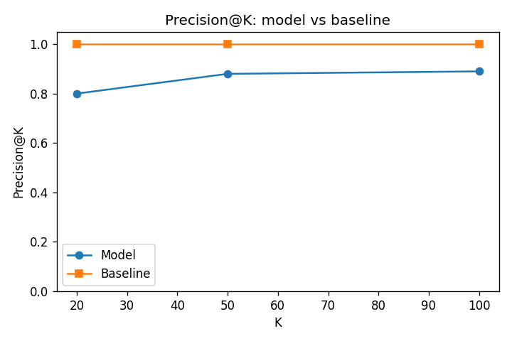

# Finding Pages That Under-Earn Their Clicks

**A leakage-safe CTR opportunity-scoring model for prioritising content review**

Arshnoor Singh · FlyRank ML Internship Capstone · Lane: CTR / Engagement Opportunity Scoring

---

## Abstract

Content teams have limited time to review pages, so the useful question is which pages to review first. I define an under-earning page as one whose click-through rate (CTR) falls below the average for its search position tier, and I predict this CTR gap from Google Analytics engagement signals alone, deliberately excluding any feature built from clicks or CTR to avoid leakage. Using a client-holdout split on roughly 180,000 pages, a simple linear model places about 88% genuine under-earners in its top 50 while never seeing CTR directly. The result is a ranked, reason-coded review queue that serves as decision-support for editors, not a guarantee that any page will improve.

## 1. Introduction

Pages lose search clicks over time, but a content team can only review a handful of pages per cycle. The decision this work supports is a prioritisation one: *of all the pages we could look at, which are most likely to be under-earning clicks for the position they already hold?* A page that ranks well but is rarely clicked is a strong candidate for a title or snippet review, because it already has visibility and only the click-through is weak.

This paper builds a repeatable model that ranks pages by their estimated CTR gap and turns that ranking into an editor-facing action queue with reason codes.

## 2. Data

**Source:** the FlyRank ML Internship warehouse release (gated). **Table:** the daily content-performance fact table, one row per page per day, carrying Google Search Console (GSC) search metrics and Google Analytics 4 (GA4) engagement metrics. **Grain:** one row = one content page on one day.

**Time window:** I developed and evaluated on `month=2026-03`, splitting by client so test clients were unseen in training. I did not run a separate time-based test on the final month (June 2026); that is noted as future work.

**What I excluded and why:**

- Rows without GSC search data (~63% of the month): no clicks or impressions means no CTR to score.
- Rows without GA4 data: my engagement features come from GA4, so I restricted to GA4-available rows (~180,000 pages).
- Pages with fewer than 100 impressions: their CTR is too noisy to trust.

*Public-safe: all client and page identifiers are salted hashes. No client names, domains, URLs, or raw search queries are reported.*

## 3. Methodology

### Target (the CTR gap)

Pages are grouped into position tiers (top 3, page 1, page 2, deep). For each tier the expected CTR is the mean CTR of pages in that tier. The target is `ctr_gap = expected_ctr − actual_ctr`: a large positive gap means the page earns fewer clicks than its position peers. Tier means are computed on **training data only** and then applied to the test set, so the target never leaks test information into training.

### Features

Seven GA4 on-site engagement signals: organic sessions, pageviews, engaged sessions, sessions, scroll events, users, and total engagement seconds. GA4 measures behaviour *after* a click, which is a separate measurement system from the search-side CTR being predicted, so using it is not circular.

### Leakage checks

- Excluded `ctr` and `clicks` — the target is built from them (circular).
- Excluded `expected_ctr` and `ctr_gap` — they are the target.
- Excluded `position` — it defines the tiers the target is measured against (circular).
- Confirmed every retained feature correlates only modestly with the target (about 0.1–0.36 in magnitude, none near ±1), consistent with a real, non-leaky signal.

### Baseline and validation

The baseline is a transparent hand rule that ranks pages by the CTR gap directly. Validation uses client-holdout (whole clients held out for testing), so the model is judged on brands it never trained on. Three regressors were compared — Linear Regression, K-Nearest Neighbors, and Decision Tree — scored on MAE and R².

## 4. Results

| Model | MAE | R² |
|---|---|---|
| Linear Regression | 0.00408 | 0.106 |
| KNN | 0.00423 | 0.038 |
| Decision Tree | 0.00450 | −0.252 |

Linear Regression performed best. The Decision Tree's negative R² means it did worse than predicting the average on unseen clients — it overfit the training clients. The simplest model generalised best. An R² of about 0.11 is modest but expected: I predict a noisy web-behaviour signal from engagement alone and deliberately excluded the leaky columns that would inflate it.

*CTR falls sharply as search position worsens — the signal the lane rests on.*

For a ranking task, Precision@K matters more than R²: of the top-K flagged pages, how many are genuine under-earners?

| K | Model | Baseline |
|---|---|---|
| 20 | 0.800 | 1.000 |
| 50 | 0.880 | 1.000 |
| 100 | 0.890 | 1.000 |

*Precision@K: the model reaches ~0.88 at K=50 using engagement signals only.*

The baseline scores 1.000 *by construction*: it ranks by the actual CTR gap — the answer itself — so it cannot find under-earners before their CTR is known. The model ranks using engagement signals only, never seeing CTR, and still places about 88% genuine under-earners in its top 50. That is the useful, honest result: engagement behaviour alone predicts under-earning well enough to build a queue an editor can act on.

## 5. Limitations & honest framing

- **Observational, not causal.** This shows an association between low engagement and a larger CTR gap. It does not prove why a page under-earns, nor that a rewrite will recover clicks.
- **Modest explanatory power.** The model explains only ~11% of the variation in the gap; much of what drives under-earning (title/snippet quality, search intent) is not in the data.
- **Few clients.** Only ~29 clients, 6 in the test set, so the held-out estimate is noisy.
- **Single month.** Developed and validated on March 2026; a time-based test on the sealed final month is future work.
- **Decision-support only.** The output is a prioritised review queue, not an automated action or outcome guarantee.

*All claims use safe language: observed, measured, directional, decision-support.*

## 6. Ranked recommendations

The model scores every page by its predicted CTR gap and produces a ranked review queue. An editor works down the list from the top.

### Reason codes and actions

- `LOW_CTR_FOR_POSITION → review_title_and_snippet`: the page earns fewer clicks than expected for its position tier. Review the search title and meta description first, since those drive clicks at a fixed position.
- `OK → monitor`: no predicted under-earning; keep watching.

### Intended use and no-go list

- **Who / what:** a content editor prioritising a limited review budget, as decision-support.
- **Human review required:** a person must confirm a flagged page's low CTR is not simply from ranking for irrelevant queries, where a rewrite would not help.
- **Never automate:** no title or content change should be applied without human review.
- **Retrain trigger:** re-run on new data (a new month, a ranking change, a seasonal swing); falling precision on reviewed pages is the signal to retrain.

## 7. Reproducibility

All work — every weekly assignment notebook and the capstone notebook — is in the project repository under `work/notebooks/`. The capstone notebook regenerates the ranked queue and every figure in this paper from the source data on each run.

Repository: [github.com/ArshnoorSinghh/ML-Project](https://github.com/ArshnoorSinghh/ML-Project)

## Acknowledgments & data credit

Built on the [FlyRank ML Internship dataset](https://flyrank.ai). Data credit: FlyRank.

*Anonymised research and education use only. No client-identifying output.*
